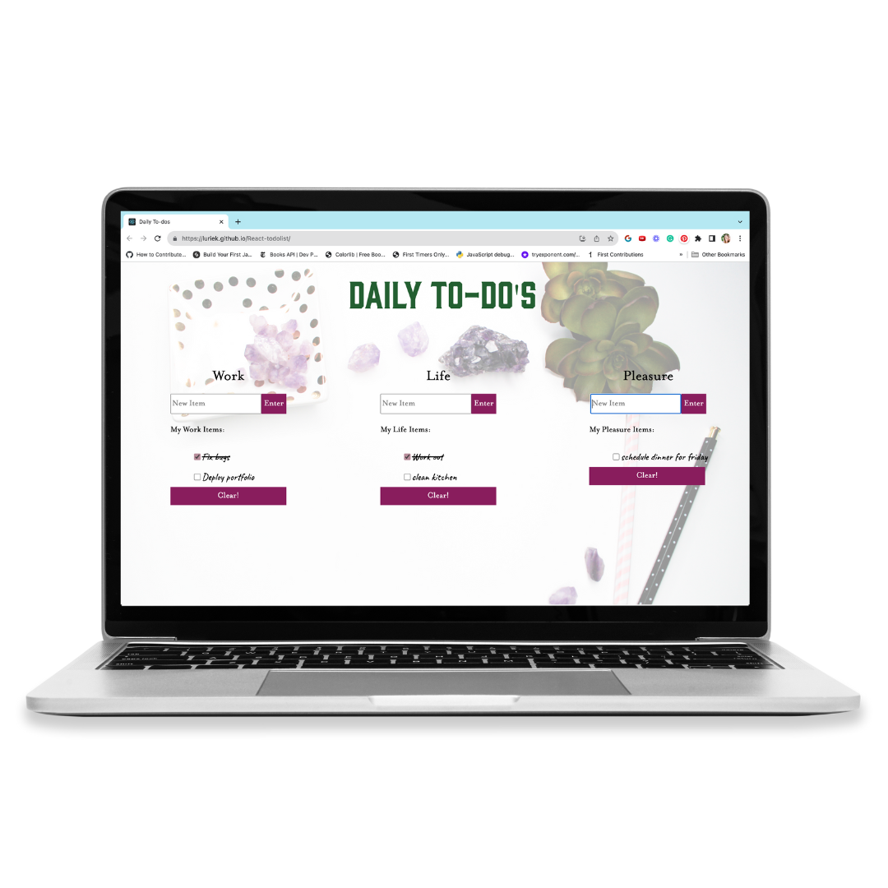
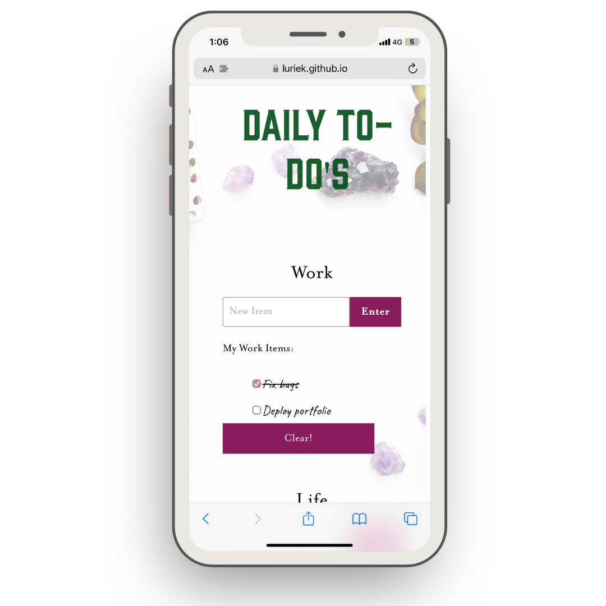

# Daily To-Dos

This web application maintains multiple to-do lists in one place. Using **React**, I've utilized useState and useEffect hooks to manage the state of each list individually and store items in localStorage. Additionally, with a focus on user experience, the application has a **responsive design**, making it easy to open on any device. 

<div align="center">
  
  
</div>

## Usage
- Creating a Task: To create a new task, enter a title in the input field at the top of the list and press Enter or hit Enter on your keyboard. 

- Marking a Task as Complete: Click on the checkbox next to a task to mark it as complete. Completed tasks will appear crossed out.

- Deleting Tasks: To delete tasks, click on the clear button bellow the item list.

- Local Storage: Task data is automatically saved to the local storage of your browser, allowing you to access your tasks even after closing and reopening the application.

## Getting Started

To run the application locally, follow these steps:

1. Clone the repository:

   ```bash
   git clone https://github.com/LurieK/DailyToDos.git

2. Navigate to the project directory:
   ```bash
   cd DailyToDos

3. Install the dependencies:

   ```bash
   npm install

4. Start the application:

   ```bash
   npm start

5. Open your web browser and visit http://localhost:3000 to access React-ToDo.

### or

to view this site visit https://luriek.github.io/React-todolist/

## How to understand this site
Daily To-Dos is a web application designed to help users organize their day while leaving room for self-care and daily pleasures. The primary goal of the app is to provide a tool that promotes a balanced approach to task management and personal well-being.  

Outside of the traditional daily tasks related to work and business, this app aims to help users plan out a more holistic day that prioritizes all aspects of life. 

### Life
Life encompasses activities that individuals engage in to care for their health, maintain relationships, and keep their home and life running smoothly. React-ToDo allows users to allocate time for essential tasks related to their well-being. Whether it's cleaning the kitchen, picking up a prescription, or making an important phone call to a family member, the app reminds users to prioritize these actions that contribute to their overall health and happiness.

### Pleasure
In addition to managing essential tasks, Daily To-dos emphasizes the significance of incorporating enjoyable activities and experiences into daily routines. The app encourages users to embrace and savor the beauty of life by making time for daily pleasures. This could involve watching a breathtaking sunset, working from a favorite café, or indulging in delicious meal. By highlighting the importance of such activities, this app promotes a more holistic and fulfilling approach to task management.

The combination of self-care and daily pleasures within Daily To-Dos aims to provide users with a comprehensive tool for managing tasks and prioritizing their well-being. By incorporating these principles into their daily routines, users can cultivate a sense of balance, fulfillment, and joy in their lives.

## Contributing
This app is a simple demo project and is not currently accepting contributions. However, if you find a bug or have a feature request, feel free to open an issue on the GitHub repository.

## License

[MIT](https://choosealicense.com/licenses/mit/)

